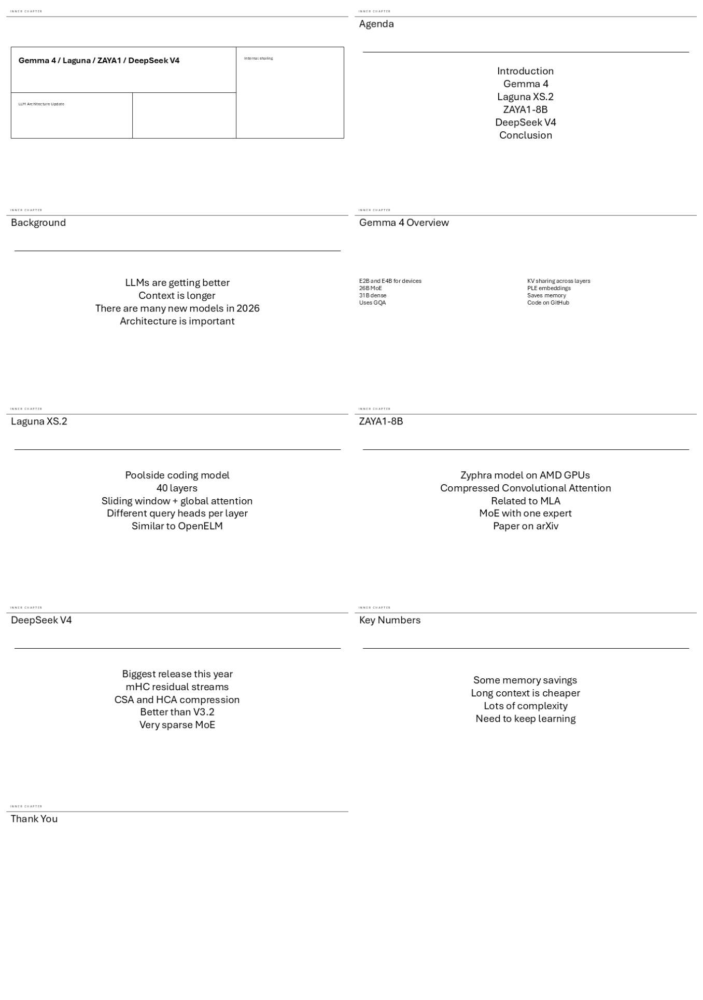
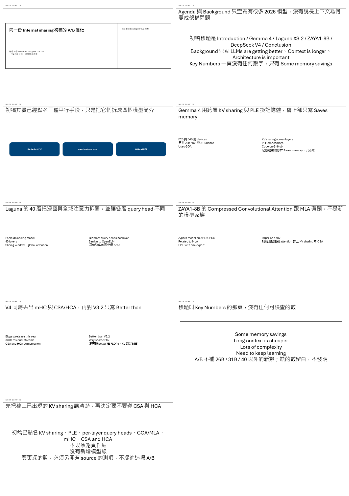
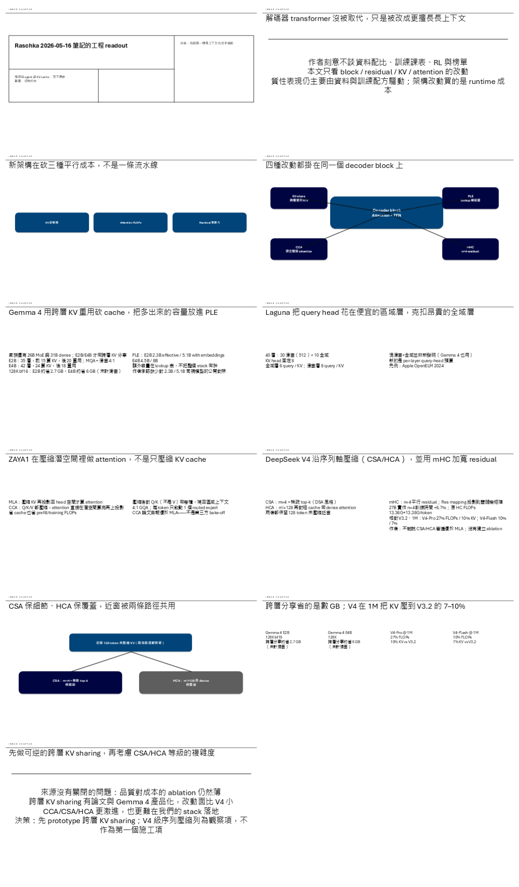
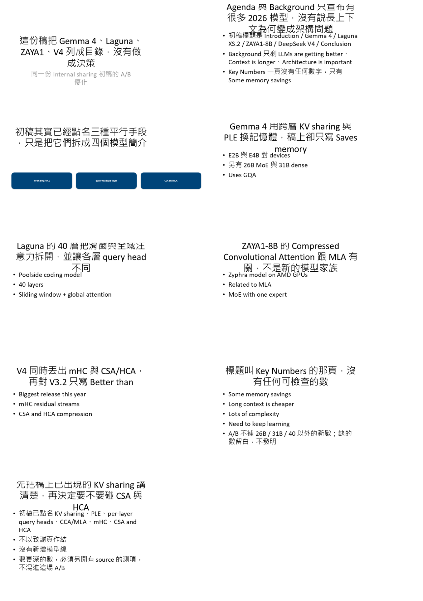
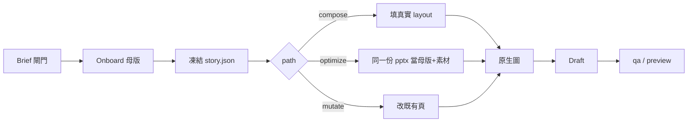

# ppt-skill-for-work

**Agent 寫故事。腳本只套你提供的真實母版。**  
不是「更會畫 PPT 的模型」。缺 brief 就拒畫；數字不在來源裡就停；流程圖必須可編輯。

[](tests/)
[](LICENSE)

---

## 先看成果（同一份初稿長出兩場 B）

A 是典型 AI 初稿：主題式標題、子彈清單、Thank You。B 用**同一套 Inner Chapter 母版**重建。

<table>
<tr>
<th>A · 初稿</th>
<th>B · A/B（不新增數字）</th>
</tr>
<tr>
<td></td>
<td></td>
</tr>
</table>

<p align="center"><strong>B · sourced</strong>（同一份 A + Raschka 筆記，深度必須勝出）</p>

<p align="center">
  
</p>

弱母版不會發明 layout，同一套 A/B 故事會降到 Title + Content：

<p align="center">
  
</p>

| 打開這個檔 | 你在看什麼 |
|---|---|
| [`eval/gold/original.pptx`](eval/gold/original.pptx) | A：AI 初稿 |
| [`eval/gold/ab/optimized.pptx`](eval/gold/ab/optimized.pptx) | B：事實鎖定，只改敘事／排版／原生圖 |
| [`eval/gold/sourced/optimized.pptx`](eval/gold/sourced/optimized.pptx) | B：可讀筆記，深度廣度必須勝 |
| [`eval/gold/ab/review.md`](eval/gold/ab/review.md) | 六維評審（A/B） |
| [`eval/gold/sourced/review.md`](eval/gold/sourced/review.md) | 六維評審（sourced） |
| [`eval/gold/README.md`](eval/gold/README.md) | 八場 gold 索引 |

本地用 PowerPoint 開 pptx。GitHub 上先看接觸圖與 `review.md`。

---

## 管線



| 你要做的事 | 指令 |
|---|---|
| 新稿 | `compose --brief --story --template` |
| 從初稿長一版 | `optimize DECK --brief --story` |
| 只改字、不拆頁 | `mutate DECK --brief --story`（layout 變更 >30% 會拒絕） |
| 看問題／縮圖 | `qa` / `preview` |

---

## 10 分鐘跑通

需要 Python 3.11+。OfficeCLI 可選（theme / qa / mermaid / screenshot）。

```bash
pip install -r requirements.txt
# 可選
npm i -g @officecli/officecli

python -m work_ppt onboard docs/fixtures/templates/dense-consulting-inner-chapter.pptx -o profiles/inner.json
python -m work_ppt gold-baseline -o eval/gold/original.pptx
python -m work_ppt gold-optimize --case all
python -m work_ppt eval-check --case ab
python -m pytest tests/ -q
```

對你自己的母版（**不要把公司檔 commit 進來**）：

```bash
python -m work_ppt compose --brief brief.json --story story.json --template YOUR.pptx -o out.pptx
python -m work_ppt preview out.pptx -o preview.png
```

`brief.json` 必填：`audience`、`language`、`path`（`compose` \| `mutate` \| `optimize`）、`template` 或 `prior_deck`、`title`、`decision`、`sources`。缺一項 CLI 結束碼 2，不寫 pptx。

`story.json` 的標題連起來必須是完整論證。每個數字都要出現在 `sources` 或 extract 裡。

把 [`skills/work-ppt/SKILL.md`](skills/work-ppt/SKILL.md) 拷到 `~/.grok/skills/work-ppt/`（或 Claude / Cursor 的 skills 目錄），之後說「做技術報告」就會走這條管線。

---

## Gold：兩場不要混

| 場次 | 數字從哪來 | B 可以多什麼 | 目錄 |
|---|---|---|---|
| **A/B** | 只能來自 A 的 extract | 敘事、排版、原生圖 | [`eval/gold/ab/`](eval/gold/ab/) |
| **sourced** | A + Raschka 筆記 | 深度廣度必須明顯勝出 | [`eval/gold/sourced/`](eval/gold/sourced/) |

同一套故事還套在另外三套公開母版上（推展性代理，不是公司檔）：

| 母版 | A/B | sourced |
|---|---|---|
| Inner Chapter（密） | [`ab/`](eval/gold/ab/) | [`sourced/`](eval/gold/sourced/) |
| 弱：Title + Content | [`weak/ab/`](eval/gold/weak/ab/) | [`weak/sourced/`](eval/gold/weak/sourced/) |
| Office 預設 11 layout | [`light/ab/`](eval/gold/light/ab/) | [`light/sourced/`](eval/gold/light/sourced/) |
| Dark navy | [`dark/ab/`](eval/gold/dark/ab/) | [`dark/sourced/`](eval/gold/dark/sourced/) |

弱母版 **layout 不要求嚴格勝出**：不發明 master + 標題是 takeaway 即過。

pytest 不呼叫模型。內部 eval 用預先備好的 grilling 答案產 story，**落盤進 git 才算數**：

```bash
python -m work_ppt eval-prompt --case ab
python -m work_ppt eval-check --case ab
```

---

## 圖怎麼用

| 種類 | Gold B（進 git） | 你真正要簡報的檔 |
|---|---|---|
| 流程 / 架構 / 時序 | 原生 shape 或 `mermaid`（OfficeCLI native） | **必須可編輯** |
| 真實照片 / 截圖 | plan 裡 `picture=` 指向既有檔 | 使用者提供的檔 |
| 生圖 | **禁止** | 可以，但**不准當流程圖或架構圖** |
| draw.io | `drawio=` SVG，或本機 draw.io CLI 匯出 | 同上 |

`generate_image` 掛在 process / architecture / sequence 上會 exit 2。

---

## CLI

```text
python -m work_ppt onboard T.pptx -o profiles/id.json
python -m work_ppt extract deck.pptx -o extract.json
python -m work_ppt plan --brief B.json --story S.json --template T.pptx -o plan.json
python -m work_ppt compose --brief B.json --story S.json --template T.pptx -o out.pptx
python -m work_ppt optimize deck.pptx --brief B.json --story S.json -o out.pptx
python -m work_ppt mutate  deck.pptx --brief B.json --story S.json -o out.pptx
python -m work_ppt qa deck.pptx -o qa.json --screenshot sheet.png
python -m work_ppt preview deck.pptx -o sheet.png
python -m work_ppt gold-optimize --case all
```

設計規格：[`docs/superpowers/specs/2026-08-21-work-ppt-workflow-design.md`](docs/superpowers/specs/2026-08-21-work-ppt-workflow-design.md)

---

## 不做什麼

- 不管母版一次生成整份
- 把流程圖畫成死 PNG
- 把公司／真實工作稿 commit 進這個開源 repo
- 在 draft 做多輪截圖 QA
- pytest / CI 呼叫模型

MIT。Eval 母版是 MIT Inner Chapter + 自產空白母版；筆記是 Raschka 2026-05-16 摘錄，不是全文轉載。
