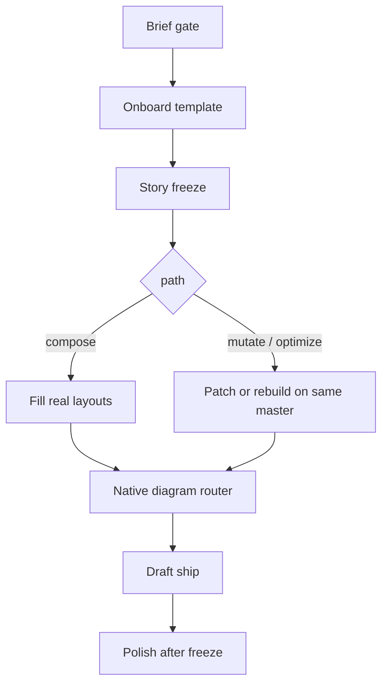

# Work PPT Workflow Design

| Field | Value |
|-------|--------|
| Status | Draft for implementation |
| Date | 2026-08-21 |
| Repo | `ppt-skill-for-work` |

> **TL;DR** — 這不是「更會畫 PPT 的 skill」。Agent 寫故事，腳本套使用者提供的母版。Gold test：一份既是母版又是素材的 deck，優化後必須在盲測中全面勝出，且版型一致。

## Overview

工作簡報的失敗來自一次生成整份、不管母版、把流程圖畫成死圖。本系統拆成閘門式管線：Brief → Onboard → Story freeze → Compose/Mutate → Diagram router → Draft → Polish。

機械層以 python-pptx 填 **真實 slide layout placeholders**，OfficeCLI 負責 mutate、Mermaid→原生 shape、polish 預覽。敘事層（ghost deck / action title）由 Agent 依 skill 寫入 `story.json`，腳本不發明結論。

## Goals

- 任意 `.pptx` / `.potx` 可 onboard（非鎖死一家公司檔）。
- 兩條路徑：`compose`（從母版組新份）與 `mutate`/`optimize`（改上份或優化同一份）。
- 流程圖、架構圖、時序圖必須是原生 shape；帶字的圖禁止生圖。
- Draft 10–15 分鐘（樣板已 profile）；Polish ≤30 分鐘。
- **Gold test（新增）：** 輸入一份同時當母版與資料來源的 deck，輸出優化版。盲測要求版型一致，且新稿在格式、排版、敘事、技術深度、邏輯、故事流暢度全面勝出。

## Non-goals

HTML-first 簡報、整頁生圖、把第三方公司檔當 repo 資產、預設重產整份、在 draft 做多輪截圖 QA。

## Proposed design



### Layer ownership

| Layer | Owns | Forbidden |
|-------|------|-----------|
| Brief | audience, language, path, template, sources, decision | 視覺 |
| Story | action titles, state transfer, density | 色碼、字體、自由畫 layout |
| Onboard / Render | 母版 fidelity | 發明數字 |
| Diagram router | mermaid/native vs generate vs forbid | 標題文案 |
| Draft vs Polish | SLA | 沒凍結就精修 |

### CLI

```text
python -m work_ppt onboard <template.pptx> -o profiles/<id>.json
python -m work_ppt extract <deck.pptx> -o extract.json
python -m work_ppt compose --template T --plan slide_plan.json -o out.pptx
python -m work_ppt optimize <deck.pptx> --story story.json -o out.pptx
python -m work_ppt gold-baseline -o eval/gold/original.pptx
```

缺 brief 欄位則拒畫。新樣板 onboard 不算進 15 分鐘 SLA。

### Layout mapping

Onboard 產出每個 layout 的 placeholder 清單（idx, type, name）。Compose 只填 TITLE / BODY / OBJECT，跳過 SLIDE_NUMBER 與 PICTURE（除非 plan 明確給真實圖檔）。

若 plan 要的視覺在母版不存在（弱母版 gold：只有 Title + Title and Content），降級為表格或拆頁，**禁止自創新 master**。

### Diagram router

| Kind | Draft | Polish |
|------|-------|--------|
| architecture / process / sequence | native shapes or OfficeCLI mermaid | 重排連線，仍原生 |
| numbers | native table/chart | theme 色 |
| real screenshot | 用提供的檔 | 裁切 |
| atmosphere, no required text | skip | 可生圖 |
| labeled flowchart as PNG | defect | defect |

### Gold test

1. 用 Inner Chapter 母版產出一份「典型 AI 初稿」`eval/gold/original.pptx`（主題式標題、子彈清單、Thank you、無 ghost deck、無數值表與原生圖）。內容事實只來自 Raschka 2026-05-16 筆記，寫進該 pptx。
2. `optimize` 只讀這份 pptx（母版+素材），產出 `eval/gold/optimized.pptx`。
3. 盲測：兩份 deck 打亂標籤。評審必須確認 theme/layouts 同源，且 B 在六個維度全面勝出。任一維打平或落敗 → 失敗，迭代。

## Data model

`brief.json` required: `audience`, `language`, `path` (`compose`|`mutate`|`optimize`), `template` or `prior_deck`, `title`, `decision`.

`profile.json`: `slide_size`, `theme` (colors/fonts from OfficeCLI get `/`), `layouts[]` with placeholders.

`story.json`: `audience_in`, `audience_out`, `decision`, `slides[]` of `{action_title, intent, layout_hint, slots[], diagram}`.

`slide_plan.json`: resolved `layout_name` + slot fills. Render 不得改 action_title。

## Alternatives

1. **HTML-first 再轉 PPTX** — 好看但吃不了任意母版，否決。
2. **OfficeCLI 從空白 add slide** — 文件寫明新頁不會自動物化 layout placeholders；組新份必須 python-pptx `add_slide(layout)`。OfficeCLI 留給 mutate 與 mermaid。
3. **整頁生圖** — 流程圖不可編輯，否決。

## Security

來源與母版預設本機。不把使用者公司檔 commit 進 git。Eval fixtures 僅 MIT Inner Chapter + 自產空白母版 + 摘錄筆記（非全文轉載）。

## Observability

每次 run 寫 `runs/<id>/`：brief、profile、extract、story、plan、pptx、`qa.json`。Gold 寫 `eval/gold/blind_review.json`。

## Rollout

v0：onboard + extract + compose + optimize + gold。v1：mutate 外科手術、第二語言 polish、四母版回歸。失敗回滾：保留 original，不覆蓋。

## Key Decisions

1. **管線不是 mega-skill** — 一次生成是痛點根源。
2. **python-pptx 填 placeholder，OfficeCLI 做 mutate/mermaid** — 對齊 OfficeCLI 自己的 layout 限制。
3. **Story 凍結後才渲染** — ghost deck 可單獨審。
4. **Gold = 優化既有 deck** — 比「空白母版填同一 brief」更接近真實工作。
5. **弱母版必須降級而非發明 layout**。
6. **Draft 禁止生圖與多輪截圖 QA**。

## PR Plan

| PR | Title | Files | Deps |
|----|-------|-------|------|
| 1 | Schemas, onboard, extract, fixtures | `work_ppt/onboard.py`, `extract.py`, `docs/fixtures` | — |
| 2 | Compose onto real layouts | `work_ppt/compose.py`, tests | 1 |
| 3 | Native diagrams | `work_ppt/diagrams.py` | 2 |
| 4 | Optimize path + gold baseline | `work_ppt/optimize.py`, `eval/gold` | 3 |
| 5 | Skill.md + CLI + iterate workflow | `skills/work-ppt`, `.grok/workflows` | 4 |

## Open Questions

- 盲測是否允許「深度持平、敘事勝出」？預設：**六維都必須勝出**（使用者原話）。
- 第二語言是否納入 v0 gold？預設否，屬 polish。

## References

- `.omc/specs/deep-interview-ppt-workflow.md`
- OfficeCLI 1.0.144
- Inner Chapter template (MIT, pptx-from-layouts)
- Raschka, 2026-05-16, LLM architecture notes in `docs/fixtures/source/`
